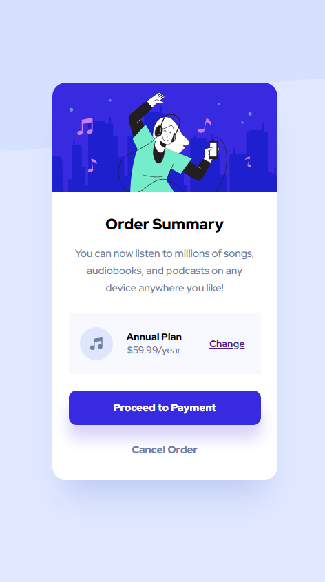
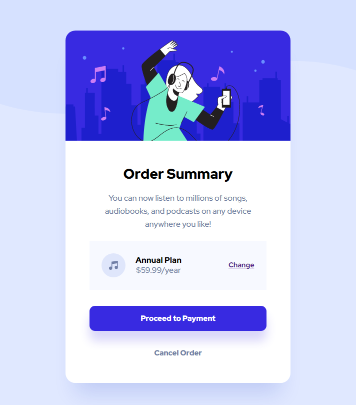

# Frontend Mentor - Order summary card solution

This is a solution to the [Order summary card challenge on Frontend Mentor](https://www.frontendmentor.io/challenges/order-summary-component-QlPmajDUj). Frontend Mentor challenges help you improve your coding skills by building realistic projects. 

## Table of contents

- [Overview](#overview)
  - [The challenge](#the-challenge)
  - [Screenshot](#screenshot)
  - [Links](#links)
- [My process](#my-process)
  - [Built with](#built-with)
  - [What I learned](#what-i-learned)
  - [Continued development](#continued-development)
- [Author](#author)

## Overview

### The challenge

Users should be able to:

- See hover states for interactive elements

### Screenshot

### Links

- Solution URL: https://github.com/jenmurph4610/orderSumComponent
- Live Site URL: https://jenmurph4610.github.io/orderSumComponent/

## My process

### Built with

- Semantic HTML5 markup
- CSS custom properties
- Flexbox
- Mobile-first workflow

### What I learned

This was a pretty simple practice project.  It came together in about 2 1/5 hours in between work tasks, without any issues to stumped me.  I'm learning more about workflow and settling into what works best for me.  There isn't as much changing and re-changing things to make them simpler as I used to have to do.  

I found that (for me) its best to start by completing the HTML, determining the breakpoints for different versions, then working from top to bottom on the font stylings (family, color, size, etc).  First for mobile, then tweaking anything needed that is different for the desktop layout.  I then moved on to the buttons and link stylings as well as any background colors and shadows.  Mobile first, then adjusting as needed for desktop again.

At that point all of the basic style was there and I just needed to arrange the layout of the contents within the card for each, and then finally adding the background image and arranging it with the body and footer to complete the page.

I did forget the hover elements initially though and they got added last, but they were easy additions. :)

This project was overall just for continued practice of things I already know and I am feeling pretty confident at how easily I've handled the last few.

### Continued development

I would like to move into projects with JavaScript.  I have one that I started and abandoned out of frustration of something that should have been simple and needing a mental break from it.  I think that I will go back to finish that one next because JS is where I really need to start challenging myself more and practicing more.

## Author

- Frontend Mentor - [@jenmurph4610](https://www.frontendmentor.io/profile/jenmurph4610)